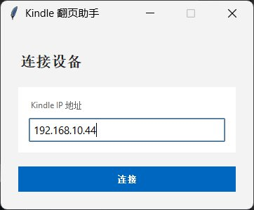
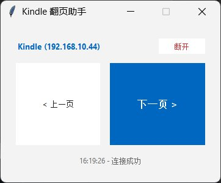

使用KOReader HTTP Inspector插件实现遥控翻页。优点是续航好很多且所有越狱Kindle都支持，但要增加一台控制设备，如电脑、笔电或带浏览器的安卓平板、手机甚至机顶盒。

方法是先让Kindle连上wifi，打开KOReader-顶部下滑-扳手-更多工具-KOReader HTTP Inspector，先勾选“Auto start HTTP server”再点击“Start HTTP server”。如果不知道Kindle的IP，点击齿轮-网络设置-网络信息，可以看到Kindle的IP。

可以直接运行py脚本 也可以在 kindle翻页助手里 找到exe文件

输入获得的ip

支持 鼠标滚轮 和按键

